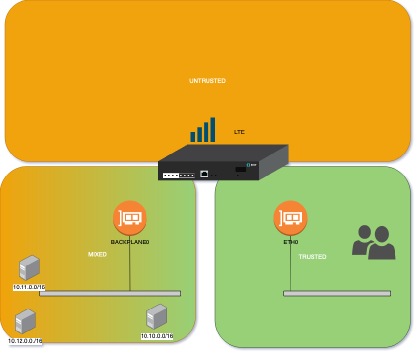

# Nodegrid-Firewall
This contains sample firewall chains which can be used together with the Nodegrid system. Firewall rules are designed to be examples.
The basic idea is that all the Chains are present on a system and through appropiate matching rules in INPUT,FORWARD and OUTPUT, will the chains allow traffic for the desired ports/functions.
Multiple Chains are created which contain the most common rules for the function.

##Setup
The .cli files contain all the required commands to install the chain. The commands can be run multiple times in case changes where done. The provided commands will then delete the existing chain and create a new one.

IMPORTENT: As the changes will take directly effect ensure that the applied changes do not block the require network traffic. To avoid this issue it is recommended to apply the changes through the console port.\

#### Copy Paste
The file content can directly be copied to an admin cli prompt

#### Import Chains from shell
The cli files can be imported directly from the shell
- login to the Nodegrid shell as an admin user
- download teh cli files to the users home directory. The this can be done for example via ssh or through the built in File Manager
- import the cli with the following commands, it is assumed that the files are in teh same folder

```
cli -f -y INPUT-TRUSTED.cli
cli -f -y INPUT-UNTRUSTED.cli
cli -f -y INPUT-VPN.cli
cli -f -y OUTPUT-TRUSTED.cli
cli -f -y OUTPUT-UNTRUSTED.cli
cli -f -y OUTPUT-VPN.cli
cli -f -y OUTPUT-TARGETS.cli
sudo iptables-dropped-logrotate.sh
sudo iptables-dropped-syslog.sh
```

#### Configuration of Firewall
The newly imported firewall chains will be displayed in the the UO and CLI and can now be used to create appropriate firewall rules.
The following steps need to be performed:
- Identify "Trusted" networks, either by IP Address range or by interface
- Identify "Untrusted" networks, this should be in general everything which is not trusted
- Identify network traffic which is allowed to route traffic through the Nodegrid.
- create INPUT rules for "Trusted" Networks
- create INPUT rules for "Untrusted" Networks
- create OUTPUT rules for "Trusted" Networks
- create OUTPUT rules for "Untrusted" Networks
- create FORWARDING rules for "Untrusted" Networks
- change the default Policies to DROP all traffic which was not specifically allowed

For the following example, are we using a Nodegrid Bold SR, which uses ETH0 as a management interface and is using a LTE interface as a backup connection.
Additionally will the traffic from any interface accepted if the source IP is from the trausted network 10.10.0.0/0 which will be in this case on BACKPLANE0



Defining INPUT rules
```
add /settings/ipv4_firewall/chains/INPUT
set target=INPUT-TRUSTED
set input_interface=eth0
commit
add /settings/ipv4_firewall/chains/INPUT
set target=INPUT-TRUSTED
set source_net4=10.10.0.0/16
commit
add /settings/ipv4_firewall/chains/INPUT
set target=INPUT-UNTRUSTED
set input_interface=LTE
commit
```

Defining OUTPUT rules
```
add /settings/ipv4_firewall/chains/OUTPUT
set target=OUTPUT-TRUSTED
set output_interface=backplane0
commit
add /settings/ipv4_firewall/chains/OUTPUT
set target=OUTPUT-TRUSTED
set destination_net4=10.10.0.0/16
commit
add /settings/ipv4_firewall/chains/OUTPUT
set target=INPUT-UNTRUSTED
set output_interface=LTE
commit
```

Changing the default policies
```
cd /settings/ipv4_firewall/policy/
set INPUT=DROP
set OUTPUT=ACCEPT
set FORWARD=DROP
commit
cd /settings/ipv6_firewall/policy/
set INPUT=DROP
set OUTPUT=ACCEPT
set FORWARD=DROP
commit
```


## Chains

### INPUT-TRUSTED
Chain is designed to be assigned to INBOUND traffic comming from trusted networks

- SNMP
- DNS
- NTP
- ICMP
- SYSLOG
- HTTPS
- SSH/SCP/SFTP
- DHCP/ZTP
- LDAP/AD
- TACACS+
- SMTP
- NFS
- FTP
- TFTP
- PXE
- KERBEROS
- ICMP

### INPUT-UNTRUSTED
Chain is designed to be assigned to INBOUND traffic comming from not trusted networks

- Only allows Established traffic
- Logs blocked traffic

### INPUT-VPN
Chain is designed to be assigned to INBOUND traffic comming from not trusted networks

- IPSEC
- SSL-VPN
- Wireguard* needs to be manually added and is only required when local system is used as a server


### OUTPUT-TRUSTED
Chain is designed to be assigned to OUTBOUND traffic going to trusted networks

- SNMP
- DNS
- NTP
- ICMP
- SYSLOG
- HTTPS
- SSH/SCP/SFTP
- DHCP/ZTP
- LDAP/AD
- TACACS+
- SMTP
- NFS
- FTP
- TFTP
- PXE
- KERBEROS
- ICMP

### OUTPUT-UNTRUSTED
Chain is designed to be assigned to OUTBOUND traffic going to not trusted networks, like WAN interfaces

- DNS
- NTP
- HTTPS
- ICMP
- Logs blocked traffic

### OUTPUT-VPN
Chain is designed to be assigned to OUTBOUND traffic going to not trusted networks, like WAN interfaces

- IPSEC
- SSL-VPN
- Wireguard* needs to be manually added and is only required when local system is used as a client

### OUTPUT-TARGETS
Chain is designed to be assigned to OUTBOUND traffic going to trusted networks, covers esp. ports required for communication with target devices

- SHH
- HTTP/HTTPS
- KVM sessions
- IPMI Sessions
- Rack PDU's

### Logging 
Blocked traffic form UNTRUSTED network are logged to syslog by default.
Syslog needs to be confirgure using the following 2 scripts:
- `iptables-syslog.sh` - setup of syslog
- `iptables-dropped-logrotate.sh` - setup of log rotation

The blocked traffic details can be found in `/var/log/iptables-dropped.log`

